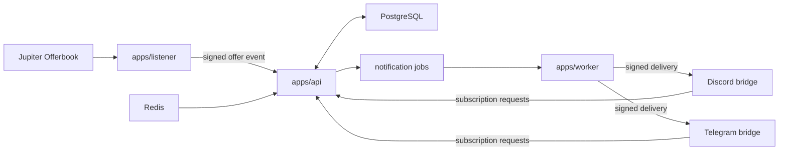

# Jupiter Offerbot

Offerbot listens for Jupiter Offerbook offer creation events and notifies users when offers match their mint and APY preferences.

## Project overview

| Workspace                               | Purpose                                                                                                         |
| --------------------------------------- | --------------------------------------------------------------------------------------------------------------- |
| [`apps/api`](apps/api/)                 | Hono API for subscription management, Offerbook-event ingestion, and notification-job creation.                 |
| [`apps/listener`](apps/listener/)       | Yellowstone gRPC listener that detects supported Jupiter Offerbook creation events and submits them to the API. |
| [`apps/worker`](apps/worker/)           | Polling outbox worker that delivers pending notification jobs to the platform bridges.                          |
| [`apps/discord`](apps/discord/)         | Discord direct-message bridge for managing subscriptions and delivering notifications.                          |
| [`apps/telegram`](apps/telegram/)       | Telegram direct-message bridge for managing subscriptions and delivering notifications.                         |
| [`packages/channel`](packages/channel/) | Platform-neutral subscription commands and notification formatting.                                             |
| [`packages/common`](packages/common/)   | Shared Offerbook, APY, and notification domain utilities.                                                       |
| [`packages/prisma`](packages/prisma/)   | Prisma client, PostgreSQL schema, and repositories for subscriptions and notification jobs.                     |
| [`packages/redis`](packages/redis/)     | Shared Redis client used by the API rate limiter.                                                               |
| [`packages/logger`](packages/logger/)   | Structured application logging.                                                                                 |

Each service’s configuration and operational details are documented in its workspace README.

## Prerequisites

- [Bun](https://bun.sh/) 1.3.14 or later
- Docker and Docker Compose for the local PostgreSQL and Redis services
- A Yellowstone gRPC endpoint and Solana RPC URL for the listener
- A Discord bot token and a Telegram bot token for the delivery bridges

## Run locally

Install dependencies and create local service configuration files:

```bash
bun install

cp apps/api/.env.example apps/api/.env
cp apps/listener/.env.example apps/listener/.env
cp apps/worker/.env.example apps/worker/.env
cp apps/discord/.env.example apps/discord/.env
cp apps/telegram/.env.example apps/telegram/.env
```

Set the required API tokens, database URL, listener endpoints, and platform bot credentials in those files. Then start PostgreSQL and Redis, generate the Prisma client, and apply the local migration:

```bash
docker compose up -d

bun run --cwd packages/prisma generate
bun run --cwd packages/prisma migrate:deploy
```

Run each service in a separate terminal:

```bash
bun run --cwd apps/api dev
bun run --cwd apps/listener dev
bun run --cwd apps/worker dev
bun run --cwd apps/discord dev
bun run --cwd apps/telegram dev
```

## Validate

```bash
bun run typecheck
bun run test
bun run lint
```

## Architecture



- `apps/listener` receives Yellowstone gRPC transaction updates, extracts supported offer-creation events, and sends them to the API with listener authentication.
- `apps/api` persists subscriptions, validates platform and listener requests, rate-limits `/v1/*`, and creates one notification job for each matching subscription.
- `apps/worker` polls pending jobs from PostgreSQL and sends signed deliveries to the corresponding Discord or Telegram bridge.
- The bridges let users manage subscriptions in direct messages and turn signed worker deliveries into platform notifications.
